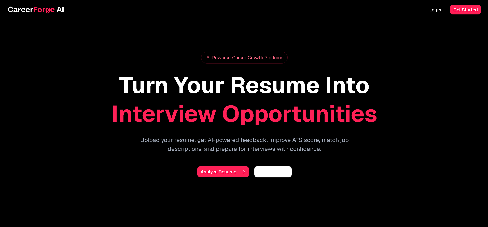
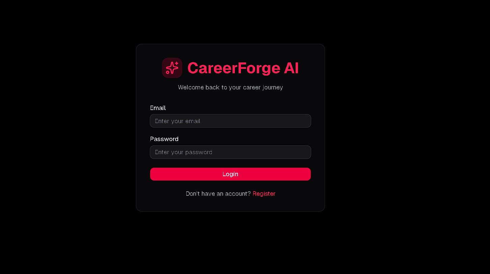
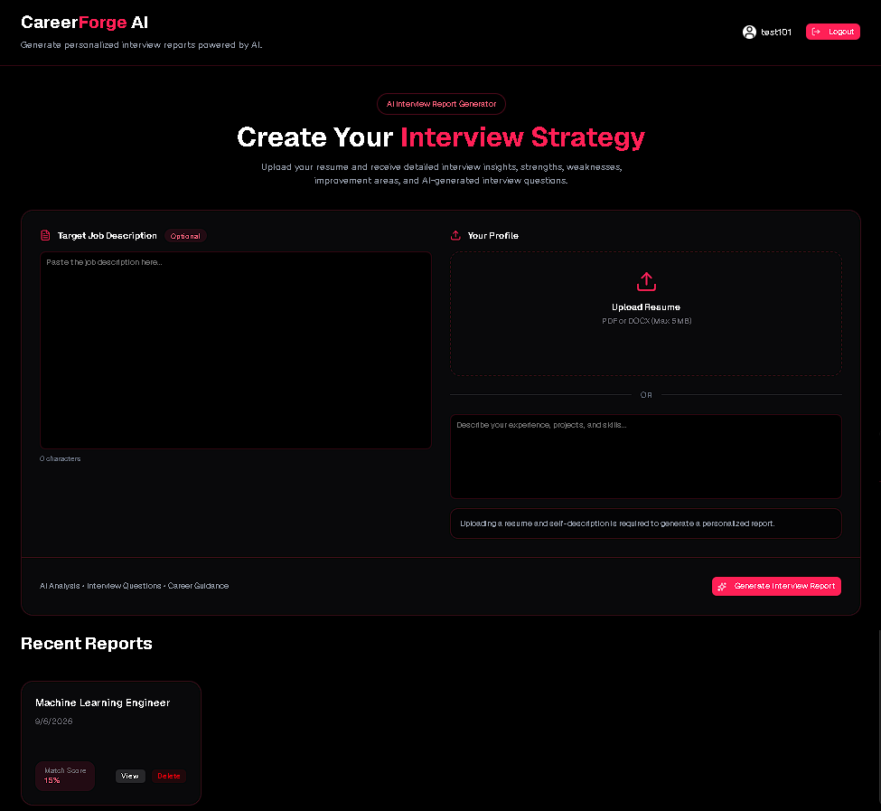
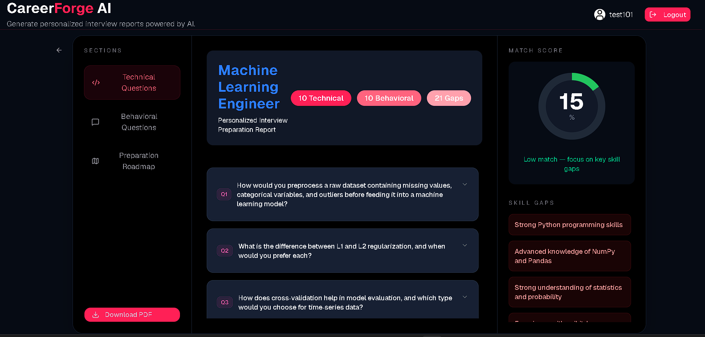

# 🚀 CareerForge AI

CareerForge AI is a full-stack AI-powered interview preparation platform that analyzes a candidate's resume against a target job description and generates a personalized interview preparation report.

The platform helps job seekers understand how well their profile matches a target role, identify skill gaps, practice technical and behavioral interview questions, and follow a personalized preparation roadmap.

---

## 🌐 Live Application

### Frontend

https://career-forge-ai-tan.vercel.app/

### Backend API

https://careerforge-ai-mcsu.onrender.com/

---

# ✨ Features

## 🔐 Authentication

- User registration
- User login
- JWT-based authentication
- Access token authentication
- Refresh token authentication
- Protected routes
- Secure cookie-based authentication
- Automatic access-token refresh
- Logout
- User-specific interview reports

---

## 📄 Resume Processing

- Resume PDF upload
- PDF text extraction
- Structured candidate profile extraction
- Candidate education extraction
- Candidate skills extraction
- Work experience extraction
- Project extraction
- Technology extraction
- Target job description support

---

## 🤖 AI-Powered Interview Analysis

CareerForge AI uses a multi-stage AI pipeline to analyze the candidate and target job.

### Candidate Analysis

- Extracts structured information from the resume
- Identifies technical and professional skills
- Extracts education and experience
- Extracts projects and technologies
- Avoids relying on unsupported candidate information

### Job Analysis

The candidate profile is compared against the target job description.

Requirements are categorized as:

- Matched
- Partial Match
- Missing

### Match Score

The match score is calculated by the backend using deterministic business logic rather than allowing the AI to choose the final score.

```text
Matched Skill  → 1
Partial Match  → 0.5
Missing Skill  → 0

# 💼 Interview Preparation

Every generated interview report contains:

* 10 technical interview questions
* 10 behavioral interview questions
* Interview intention for each question
* Preparation guidance for each question
* Skill gaps
* Skill-gap severity
* Personalized preparation roadmap
* Overall match score

### Technical Questions

Questions are generated based on:

* Candidate skills
* Candidate experience
* Candidate projects
* Target job requirements
* Identified technical gaps

### Behavioral Questions

Behavioral questions are generated without inventing unsupported candidate experiences.

When a specific experience is not available, the report provides preparation guidance for creating an answer from the candidate's real experience.

---

# 📊 Dashboard

The dashboard allows users to:

* View generated interview reports
* Open detailed reports
* Delete reports
* Access reports belonging to their account
* Navigate through the application responsively

---

# 📑 PDF Interview Reports

Users can download their interview reports as professionally formatted PDF documents.

PDF reports include:

* CareerForge AI branding
* Candidate match score
* Technical interview questions
* Behavioral interview questions
* Skill gaps
* Skill-gap severity
* Preparation roadmap
* Page numbering

PDF generation is handled using Puppeteer.

---

# 🧠 AI Architecture

CareerForge AI uses a multi-stage AI pipeline.

Instead of sending the raw resume independently to multiple AI prompts, the system first converts the resume into a structured candidate profile and then reuses that profile in subsequent stages.

```text
                         Resume PDF
                             │
                             ▼
                    PDF Text Extraction
                             │
                             ▼
              ┌──────────────────────────┐
              │ Candidate Profile        │
              │ Extraction - AI #1       │
              └────────────┬─────────────┘
                           │
                           ▼
                  Structured Candidate
                       Profile
                           │
                           ▼
              ┌──────────────────────────┐
              │ Job Description Analysis │
              │          AI #2            │
              └────────────┬─────────────┘
                           │
                           ▼
             Matched / Partial / Missing
                       Skills
                           │
                           ▼
                 Backend Scoring
                           │
                           ▼
                     Match Score
                           │
                           ▼
              ┌──────────────────────────┐
              │ Interview Report         │
              │ Generation - AI #3       │
              └────────────┬─────────────┘
                           │
                           ▼
                  Interview Report
                           │
                           ▼
                       MongoDB
                           │
                           ▼
                      Frontend
```

---

# 🔬 AI Pipeline Stages

## Stage 1 — Candidate Profile Extraction

The uploaded resume is converted into a structured candidate profile.

The profile contains:

```text
Candidate
├── Name
├── Education
├── Skills
├── Experience
├── Experience Summary
└── Projects
```

The extraction process uses structured JSON output and validates the result using Zod.

Missing information is represented using appropriate empty values rather than invented information.

---

## Stage 2 — Job Description Analysis

The structured candidate profile is compared against the target job description.

The AI identifies:

```text
Matched Skills
Partial Matches
Missing Skills
```

The analysis is based on evidence available in the candidate profile.

The system does not assume that a candidate possesses a skill simply because the skill is related to another technology they know.

---

## Stage 3 — Deterministic Match Score

The backend calculates the final match score.

The AI provides the classification, while the backend owns the scoring logic.

```text
Matched = 1
Partial = 0.5
Missing = 0
```

This makes the score deterministic and reproducible.

---

## Stage 4 — Interview Report Generation

The final AI stage generates the interview preparation report using:

* Candidate profile
* Job description
* Job analysis
* Match score

The generated report contains:

* Technical questions
* Behavioral questions
* Interview intentions
* Preparation guidance
* Skill gaps
* Skill-gap severity
* Preparation roadmap

The generated output is validated using Zod before being returned or persisted.

---

# 🛡️ AI Reliability

The AI pipeline includes several safeguards:

* Structured JSON responses
* Zod schema validation
* Retry handling
* Temperature set to 0 for structured analysis
* Backend-controlled match score
* Candidate evidence-based analysis
* Protection against unsupported candidate claims
* Fixed number of technical and behavioral questions
* Validation before storing reports

---

# 🛠️ Tech Stack

## Frontend

* React.js
* Vite
* Tailwind CSS
* React Router
* Axios
* Context API
* React Hook Form
* Zod
* shadcn/ui
* Radix UI
* Lucide Icons

---

## Backend

* Node.js
* Express.js
* MongoDB
* Mongoose
* JWT
* bcrypt
* Multer
* Zod
* pdf-parse
* Puppeteer

---

## AI

* Groq API
* `openai/gpt-oss-120b`

---

## Infrastructure & Deployment

* Vercel — Frontend deployment
* Render — Backend deployment
* MongoDB Atlas — Database
* GitHub — Source control

---

# 📁 Project Structure

```text
CareerForgeAI
│
├── Frontend
│   │
│   ├── public
│   │
│   ├── src
│   │   ├── components
│   │   ├── pages
│   │   ├── services
│   │   ├── hooks
│   │   ├── context
│   │   └── ...
│   │
│   ├── package.json
│   └── ...
│
├── Backend
│   │
│   ├── src
│   │   ├── modules
│   │   │   └── Interview
│   │   │       ├── controllers
│   │   │       ├── services
│   │   │       │   ├── ai
│   │   │       │   └── pdf
│   │   │       ├── schema
│   │   │       └── utils
│   │   │
│   │   ├── middleware
│   │   ├── config
│   │   └── ...
│   │
│   ├── package.json
│   ├── server.js
│   └── ...
│
└── README.md
```

---

# ⚙️ Installation

## 1. Clone the Repository

```bash
git clone https://github.com/your-username/career-forge-ai.git
```

Navigate into the project:

```bash
cd career-forge-ai
```

---

# 🔧 Backend Setup

Navigate to the backend:

```bash
cd Backend
```

Install dependencies:

```bash
npm install
```

Create a `.env` file in the Backend directory.

```env
PORT=

MONGO_URI=

ACCESS_TOKEN_SECRET=
ACEES_TOKEN_EXPIRY=

REFRESH_TOKEN_SECRET=
_REFRESH_TOKEN_EXPIRY=

GROQ_API_KEY=

URLS=
```

Start the development server:

```bash
npm run dev
```

For production:

```bash
npm run start
```

---

# 🎨 Frontend Setup

Open a new terminal.

Navigate to the frontend:

```bash
cd Frontend
```

Install dependencies:

```bash
npm install
```

Create a `.env` file:

```env
VITE_API_URL=
```

Example:

```env
VITE_API_URL=https://your-backend-domain.com/api/v1
```

Start the frontend:

```bash
npm run dev
```

---

# 🔒 Environment Variables

Environment variables contain sensitive credentials and configuration values.

Never commit `.env` files or secret values to GitHub.

---

## Backend Environment Variables

```env
PORT=

MONGO_URI=

ACCESS_TOKEN_SECRET=
ACEES_TOKEN_EXPIRY=

REFRESH_TOKEN_SECRET=
_REFRESH_TOKEN_EXPIRY=

GROQ_API_KEY=

URLS=
```

### `MONGO_URI`

MongoDB Atlas connection string.

### `ACCESS_TOKEN_SECRET`

Secret used for signing access tokens.

### `ACEES_TOKEN_EXPIRY`

Access token expiration configuration.

### `REFRESH_TOKEN_SECRET`

Secret used for signing refresh tokens.

### `_REFRESH_TOKEN_EXPIRY`

Refresh token expiration configuration.

### `GROQ_API_KEY`

API key used to access Groq AI models.

### `URLS`

Comma-separated list of allowed frontend origins for CORS.

Example:

```env
URLS=https://your-frontend-domain.com,http://localhost:5173,http://localhost:4173
```

---

## Frontend Environment Variables

```env
VITE_API_URL=
```

Example:

```env
VITE_API_URL=https://your-backend-domain.com/api/v1
```

---

# 🚀 Production Deployment

CareerForge AI uses a separated frontend and backend deployment architecture.

```text
                         Internet
                            │
                            ▼
                 ┌─────────────────────┐
                 │       Vercel        │
                 │ React Frontend      │
                 └──────────┬──────────┘
                            │
                            │ HTTPS REST API
                            ▼
                 ┌─────────────────────┐
                 │       Render        │
                 │ Express Backend     │
                 └──────────┬──────────┘
                            │
                 ┌──────────┴──────────┐
                 │                     │
                 ▼                     ▼
        ┌─────────────────┐   ┌─────────────────┐
        │  MongoDB Atlas  │   │    Groq API     │
        │    Database     │   │   AI Inference  │
        └─────────────────┘   └─────────────────┘
```

---

## Frontend — Vercel

Live application:

```text
https://career-forge-ai-tan.vercel.app/
```

---

## Backend — Render

Live backend:

```text
https://careerforge-ai-mcsu.onrender.com/
```

---

## Database — MongoDB Atlas

MongoDB Atlas is used for persistent application data including:

* User accounts
* Interview reports
* Candidate information
* Job descriptions
* Generated interview preparation data

---

## AI — Groq

Groq provides the LLM inference used by the multi-stage interview analysis pipeline.

---

# 🧪 Testing & Validation

The application has been tested across the primary development and production workflows.

## Authentication Testing

* User registration
* User login
* Access token handling
* Refresh token handling
* Protected routes
* Logout
* Production CORS

---

## Interview Pipeline Testing

* Resume PDF upload
* PDF text extraction
* Candidate profile extraction
* Job description analysis
* Matched skill detection
* Partial match detection
* Missing skill detection
* Deterministic match score
* Interview report generation
* MongoDB persistence

---

## Report Testing

* Report retrieval
* Technical questions
* Behavioral questions
* Skill gaps
* Preparation roadmap
* Report deletion
* User ownership validation

---

## PDF Testing

* HTML report rendering
* Puppeteer PDF generation
* PDF download
* PDF formatting
* Production Chrome configuration

---

## Production Testing

The deployed application has been tested across:

```text
Vercel Frontend
      ↓
Render Backend
      ↓
MongoDB Atlas
      ↓
Groq API
```

Production authentication, interview report generation, API communication, and PDF generation have been validated.

---

# 🔐 Security

CareerForge AI implements application-level security practices including:

* JWT authentication
* Access and refresh tokens
* Protected API routes
* Secure cookie-based authentication
* Password hashing with bcrypt
* Request validation using Zod
* CORS origin validation
* User-specific resource access
* Ownership checks for report retrieval
* Ownership checks for report deletion
* Environment-based secret management
* No secret credentials committed to source control

---

## 📸 Screenshots

### 🏠 Landing Page



### 🔐 Login



### 📝 Interview Report Generator



### 🤖 AI Interview Report



# 📈 Key Engineering Concepts Demonstrated

CareerForge AI demonstrates practical full-stack engineering concepts including:

* REST API architecture
* Modular backend architecture
* JWT authentication
* Access and refresh token flows
* Secure cookie handling
* MongoDB data modeling
* Mongoose
* React component architecture
* Context API
* API service abstraction
* Form validation
* Zod schema validation
* PDF processing
* File uploads
* AI/LLM integration
* Structured LLM outputs
* Multi-stage AI pipelines
* Deterministic business logic
* Retry handling
* PDF generation
* CORS configuration
* Production environment configuration
* Cloud deployment

---

# 🏗️ Architecture Principles

The AI system follows a simple-to-complex architecture:

```text
Simple
  ↓
Functional
  ↓
Structured AI Pipeline
  ↓
Deterministic Business Logic
  ↓
Production Deployment
```

The application separates:

* AI reasoning
* Business logic
* Data persistence
* API handling
* Presentation

The match score is intentionally owned by backend business logic instead of the LLM.

---

# 🔮 Future Improvements

Potential future improvements include:

* Admin dashboard
* Interview history analytics
* Interview progress tracking
* Mock interview module
* Real-time AI interview assistant
* AI-powered interview chat
* Email notifications
* Multiple AI provider support
* Advanced candidate analytics
* More sophisticated weighted job requirement scoring
* Interview performance tracking
* Personalized learning recommendations

---

# 🎯 Project Objective

CareerForge AI was built to solve a practical problem:

> Preparing for an interview requires understanding both what a job demands and where a candidate currently stands.

The platform combines resume analysis, job-description analysis, deterministic skill matching, and AI-generated interview preparation into a single workflow.

The goal is to help candidates move from:

```text
Resume
   ↓
Job Description
   ↓
Skill Gap
   ↓
Interview Questions
   ↓
Preparation Plan
   ↓
Interview Readiness
```

---

# 👨‍💻 Author

Built as a full-stack AI project to demonstrate practical software engineering, AI integration, backend architecture, and production deployment.

---

## ⭐ If you find this project useful

Consider giving the repository a star and exploring the project.

```
```
